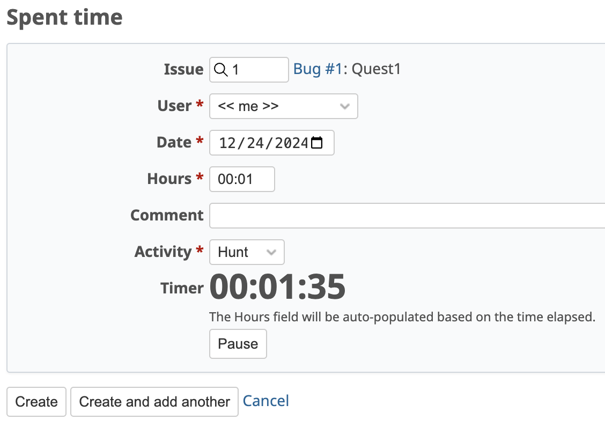

# Redmine Stopwatch Plugin

A stopwatch that auto-populates the hours field in the time log screen.

# Tested redmine version

| plugin version | tested redmine version |
|----------------|------------------------|
| 0.1.0          | 6.0.2                  |

# Install

To install this plugin, follow the general [Redmine's Plugin installation](https://www.redmine.org/projects/redmine/wiki/Plugins#Installing-a-plugin)

* clone this project to user redmine's plugins directory
* run `rake redmine:plugins:migrate`
* restart Redmine

# Configuration

no configuration needed

# Screens

[Stopwatch in spent time screen]

